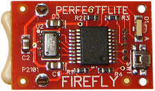

# Level 0 Guide

## Target Audience
Suppose for a moment you want to avoid electronics and software all-together. Maybe you tried programming once and wrote some fine spaghetticode before deciding that programming was not for you. Maybe you burned your hand on a soldering iron and have lasting trauma. [Maybe Professor Gary Gillespie gave you a professionalism infraction](https://github.com/prpaxson/gary/blob/master/gary). It happens.

This guide is for you.

For those who wish to avoid designing and programming their own flight computer from Arduino and breakout board components, this guide provides a few recommendations for off-the-shelf avionics packages that can be simply purchased and flown on the rocket.

## Purchase an All-in-One Package

Luckily, the problem of finding the maximum altitude of a small rocket is a solved problem. There exist many all-in-one avionics packages that accomplish this task. This level of avionics involves just purchasing one of these solutions. 

RocketsEtc maintains a list of the notable ones [here](http://rocketsetc.com/altimeter-comparison/). This might be a good place to start looking.

### My Recommendation

{align=right}

If you just want something that works, I have heard good things about the PerfectFlite FireFly. It has a fairly lean pricetag ($29.95) along with [accessible documentation](http://www.perfectflite.com/Downloads/FireFly%20manual.pdf).

The module itself can report max altitude through a pattern of LED blinks. If you get the [optional field display](https://perfectflitedirect.com/firefly-field-data-display/) (Additional $34.95, but can be shared across teams) then you can get additional information about the flight.

## Considerations

- Only your have a full understanding of your specific avionics needs. Be sure to do thorough research to select the best pre-built solution for your rocket.
- Read any documentation and datasheets carefully. Different altimeters have different accuracies, operating parameters, data recording capabilities, and other features. Make sure you are covered.
