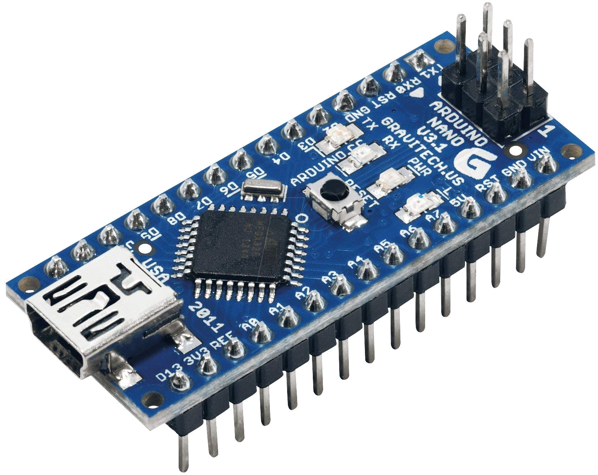
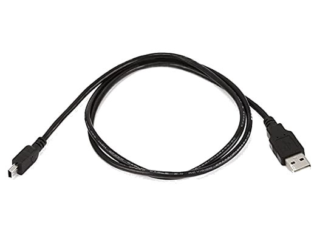
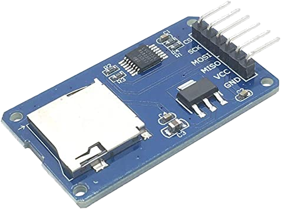
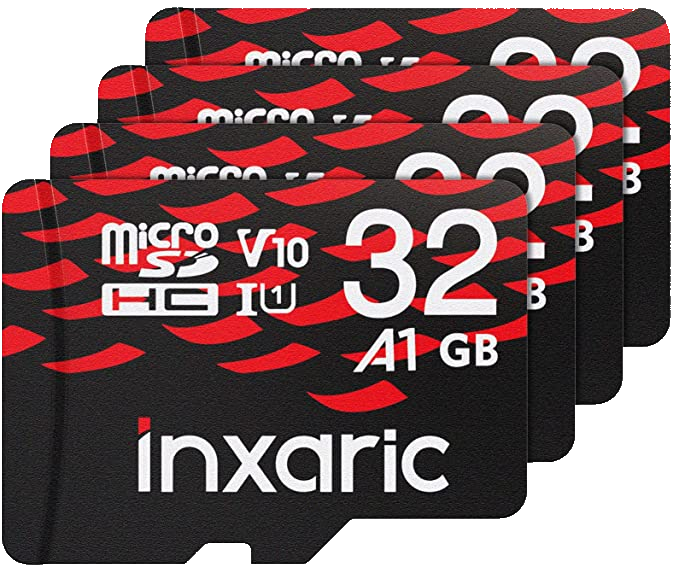
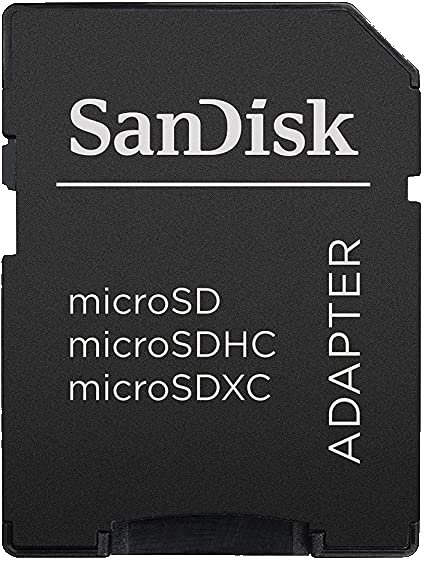
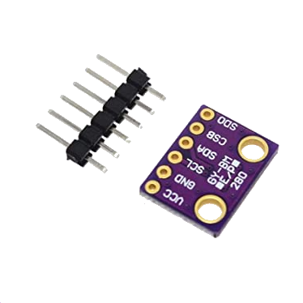
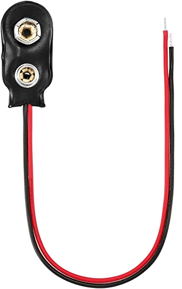
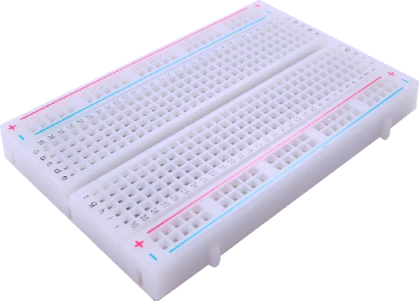
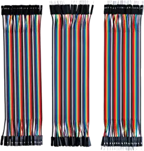

# Level 1: Start Here!

## Target Audience
This guide is oriented towards teams that are interested in building a flight computer from Arduino components.  Teams that undertake this level of Avionics either have some programming and/or hardware experience, or are eager to learn. In addition to delivering a flight computer, this guide will teach some of the skills used every weekend by RPL Avionics.

The Level 1 Flight Computer achieves the minimum avionics requirements for NMP rockets outlined on the [homepage](../index.md). 

## Hardware Requirements

One cannot build a flight computer without hardware! Before starting this guide, ensure that the following modules are provisioned.

### Arduino Nano

{ width="200" align=left }

Arduinos are single-board microcontrollers designed for rapidly iterating and prototyping electronic devices. Arduinos can be easily programmed to interact with the world via its electronic pin inputs and outputs. This guide uses the Arduino Nano, an Arduino with a smaller form-factor and leaner mass. While it has a weaker processor compared to other Arduino models, it will be more than enough for our purposes. 

- [:material-cart-variant: Amazon Link](https://www.amazon.com/Deegoo-ATmega328P-Microcontroller-Board-Arduino/dp/B07R9VWD39/ref=asc_df_B07R9VWD39/?tag=hyprod-20&linkCode=df0&hvadid=459728334703&hvpos=&hvnetw=g&hvrand=15700802515036193916&hvpone=&hvptwo=&hvqmt=&hvdev=c&hvdvcmdl=&hvlocint=&hvlocphy=9031300&hvtargid=pla-945070251730&psc=1&region_id=674469)
- [:material-cart-variant: Cheaper in Bulk; Coordinate with Multiple Teams](https://www.amazon.com/LAFVIN-Board-ATmega328P-Micro-Controller-Arduino/dp/B07G99NNXL/ref=sr_1_3?crid=3MR2CKU9YVS7Q&keywords=arduino+nano&qid=1674865137&s=electronics&sprefix=arduino+nano%2Celectronics%2C146&sr=1-3)

### Male-to-Male USB to Mini-USB Cable

{ width="150" align=left }

The Arduino Nano has a mini USB port that is used to upload code and provide power when plugged into a computer. This cable is listed here for completeness, but **if you used the above purchasing link, you should not need to acquire an extra.** Also, if working on a computer without a USB B port, you might want to get a wire that works.

- [:material-cart-variant: Amazon Link (Get Only If Needed)](https://www.amazon.com/dp/B003L18SHC/ref=twister_B0BMYH6DZS?_encoding=UTF8&th=1)

### Micro SD Card Module

{ width="200" align=left }

Arduinos are just microcontrollers; they only execute code instructions and have no way to save data permanently. An SD Card Module provides the Arduino with an interface to a permanent storage medium. This is where data will be written during flight.

- [:material-cart-variant: Cheaper in Bulk; Coordinate with Multiple Teams](https://www.amazon.com/HiLetgo-Adater-Interface-Conversion-Arduino/dp/B07BJ2P6X6/ref=sr_1_3?keywords=arduino+sd+card+module&qid=1674866046&s=electronics&sprefix=arduino+sd+c%2Celectronics%2C143&sr=1-3)

### Micro SD Card

{ width="200" align=left }

An SD Card Module is no use without an SD Card! While this guide provides a suggestion for completeness, any _SDHC_ SD Card will work.

!!! warning "Only SDHC Micro-SD Cards are Supported!"

    There are two types of SD cards on the market. **SDHC** cards have 32 GB or less of storage, whereas **SDXC** cards can have more than 32 GB of storage. The built-in Arduino SD Card library **can only handle SDHC cards.** If purchasing a different Micro SD card, be sure to look for the SDHC logo.

- [:material-cart-variant: Cheaper in Bulk; Coordinate with Multiple Teams](https://www.amazon.com/dp/B08PSVL8VQ/ref=sspa_dk_detail_3?pd_rd_i=B08PSVL8VQ&pd_rd_w=oWwEw&content-id=amzn1.sym.dd2c6db7-6626-466d-bf04-9570e69a7df0&pf_rd_p=dd2c6db7-6626-466d-bf04-9570e69a7df0&pf_rd_r=MH13FB2QG7ZY69QBJYFJ&pd_rd_wg=LnXKQ&pd_rd_r=33f34be6-dcc0-4e6a-8c4c-ec46a722fba7&s=electronics&sp_csd=d2lkZ2V0TmFtZT1zcF9kZXRhaWxfdGhlbWF0aWM&spLa=ZW5jcnlwdGVkUXVhbGlmaWVyPUEzRDNCQk1EMEMwSUhOJmVuY3J5cHRlZElkPUEwNTkxMTQ4V0dRQUdXVTJZTFpVJmVuY3J5cHRlZEFkSWQ9QTA4NjgxMzcyTk40RlpYTVI5Ulo0JndpZGdldE5hbWU9c3BfZGV0YWlsX3RoZW1hdGljJmFjdGlvbj1jbGlja1JlZGlyZWN0JmRvTm90TG9nQ2xpY2s9dHJ1ZQ&th=1)

### Micro SD Card Adapter

{ width="75" align=left }

This allows a micro-sd card to be inserted into a laptop or other SD card reading peripheral. If your team already has one of these, or some other means of connecting the SD card to a computer, then getting another is not required.

- [:material-cart-variant: Amazon Link](https://www.amazon.com/SanDisk-microSD-Memory-Adapter-MICROSD-ADAPTER/dp/B0047WZOOO/ref=sr_1_4?gclid=Cj0KCQiAic6eBhCoARIsANlox85EjkUqaQc5V8nMLdVNrpXrVBXTIz_404sPBit4N20qoDr0M-LI0gAaAh1QEALw_wcB&hvadid=177354290590&hvdev=c&hvlocphy=9031300&hvnetw=g&hvqmt=e&hvrand=8738942692984077309&hvtargid=kwd-72984448&hydadcr=18886_9696396&keywords=sd+card+adapters&qid=1674867196&sr=8-4)

### BMP 280

{ width="175" align=left }

This is a temperature and pressure sensor. Because air pressure is related to altitude, we can use this sensor as an altimeter. Per the spec sheet, the sensor provides an accuracy for altitude of (+/-) 1 meter, but your mileage may vary. Tl;dr: It's good enough for what we need it to do.

- [:material-cart-variant: Cheaper in Bulk; Coordinate with Multiple Teams](https://www.amazon.com/KOOBOOK-GY-BMP280-3-3-Precision-Atmospheric-Barometric/dp/B07S98QBTQ/ref=asc_df_B07S98QBTQ/?tag=hyprod-20&linkCode=df0&hvadid=475811371342&hvpos=&hvnetw=g&hvrand=7115418852076590703&hvpone=&hvptwo=&hvqmt=&hvdev=c&hvdvcmdl=&hvlocint=&hvlocphy=9031300&hvtargid=pla-1017264232486&psc=1)

### 9V Battery Clip
{ width="100" align=left }

The Arduino Nano can receive power from a computer via a mini-USB cable. However, this power supply does not exactly fit onto a rocket. A 9-volt battery clip will be soldered to the Arduino to provide plenty of power to the Arduino during flight. **Battery not included; be sure to pick one up yourself.**

- [:material-cart-variant: Cheaper in Bulk; Coordinate with Multiple Teams](https://www.amazon.com/Chanzon-Battery-Connector-Leather-Housing/dp/B083QFMXXW/ref=sxin_15_pa_sp_search_thematic_sspa?content-id=amzn1.sym.14a246c3-7a62-40bf-bdd0-5ac67c2a1913%3Aamzn1.sym.14a246c3-7a62-40bf-bdd0-5ac67c2a1913&crid=3HQU07W1BTO2Z&cv_ct_cx=9v%2Bbattery%2Barduino&keywords=9v%2Bbattery%2Barduino&pd_rd_i=B083QFMXXW&pd_rd_r=895aa5d5-6567-4d2d-903e-3b83d21badd7&pd_rd_w=9glod&pd_rd_wg=uxCQK&pf_rd_p=14a246c3-7a62-40bf-bdd0-5ac67c2a1913&pf_rd_r=JH9QAP1KX6P6MJC3JQXG&qid=1674868597&sprefix=9v%2Bbattery%2Barduino%2Caps%2C147&sr=1-3-a73d1c8c-2fd2-4f19-aa41-2df022bcb241-spons&smid=A14FP9XIRL6C1F&spLa=ZW5jcnlwdGVkUXVhbGlmaWVyPUE5RjhOVkVIRFU1RFomZW5jcnlwdGVkSWQ9QTA2Mjc5NTQyMkNKOUVMQzVOTTZEJmVuY3J5cHRlZEFkSWQ9QTAxMzk3OTkzSVRNMEFHMkZBTjJKJndpZGdldE5hbWU9c3Bfc2VhcmNoX3RoZW1hdGljJmFjdGlvbj1jbGlja1JlZGlyZWN0JmRvTm90TG9nQ2xpY2s9dHJ1ZQ&th=1)

### Breadboard

{ width="150" align=left }

Breadboards are boards where electronic circuits can be temporarily assembled for prototyping and testing. While not required, it is **strongly recommended** for your team to acquire a breadboard.

- [:material-cart-variant: Cheaper in Bulk; Coordinate with Multiple Teams](https://www.amazon.com/Breadborad-Solderless-Breadboards-Distribution-Connecting/dp/B082VYXDF1/ref=sr_1_2_sspa?keywords=breadboard&qid=1674869233&sr=8-2-spons&psc=1&spLa=ZW5jcnlwdGVkUXVhbGlmaWVyPUE0WEpYQzFNUUI3WlUmZW5jcnlwdGVkSWQ9QTA0MzU4OTdYUjA3UUhZQ1E5RDYmZW5jcnlwdGVkQWRJZD1BMDkzNzYzNTFMUllWRTM1NEFHSlomd2lkZ2V0TmFtZT1zcF9hdGYmYWN0aW9uPWNsaWNrUmVkaXJlY3QmZG9Ob3RMb2dDbGljaz10cnVl)

### Jumper Cables

{ width="150" align=left }

Jumper cables interface with IO pins, allowing multiple boards and breadboards to be connected together easily. Like other cables, jumper cables come in male and female form-factors. It is always good to have a variety of jumper cables on hand.

- [:material-cart-variant: Amazon Link](https://www.amazon.com/Elegoo-EL-CP-004-Multicolored-Breadboard-arduino/dp/B01EV70C78/ref=sr_1_1_sspa?keywords=arduino%2Bjumper%2Bwires&qid=1674869594&sr=8-1-spons&spLa=ZW5jcnlwdGVkUXVhbGlmaWVyPUEzTUI2ODBSREtOVE8xJmVuY3J5cHRlZElkPUEwMjEyMDQ5MUFKUDQ5RkdONlVMNiZlbmNyeXB0ZWRBZElkPUEwOTQ1MzIxMUVLUFZPSjk1OTFYOSZ3aWRnZXROYW1lPXNwX2F0ZiZhY3Rpb249Y2xpY2tSZWRpcmVjdCZkb05vdExvZ0NsaWNrPXRydWU&th=1)

## "I Found a Cheaper Board:" Reputable Vendors vs. Knockoffs

When provisioning Arduino modules, one can find two broad categories of modules. **Reputable vendors** like Adafruit sell modules at moderate prices, whereas **Knockoff vendors** sell boards that look similar to those of reputable vendors but at much lower prices.

Reputable vendors tend to be the first ones to design and manufacture modules. They are the primary folks behind the code libraries that complement the hardware. These boards usually come with higher price tags and better documentation and support.

Knockoff vendors make their own versions of the modules made by reputable vendors. They take advantage of bulk purchasing and the existing libraries made by the reputable vendor to keep costs down. However, there is no gurantee that knockoff boards will work with existing libraries. Sometimes, knockoff boards require some debugging and "motivation" to become functional. Moreover, knockoff boards have a higher risk of being defective, and knockoff vendors will generally not provide replacements for defective boards.

In this guide, we link several boards made by knockoff vendors. Luckily, the legwork has been done; these guides should cover any gotchas and obtuse quirks of these knockoff boards.

Just keep these ideas in mind if shopping for additional boards or cheaper versions of the boards listed in this guide.