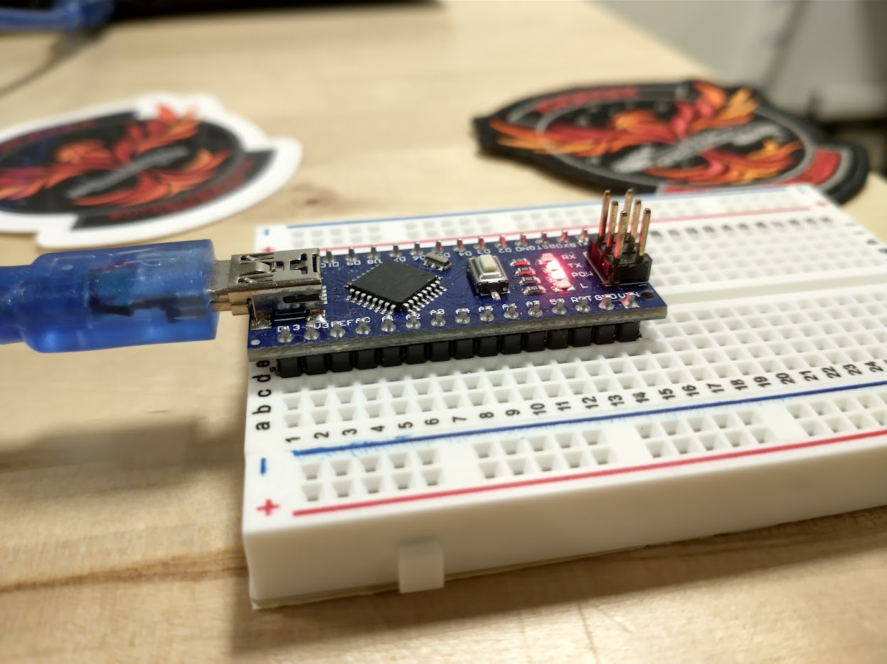

# Arduino "Hello, World!"

In this chapter, we will ensure that our Arduino Nano is ready for both hardware and software development.

## Mount Arduino to Breadboard
Before we write any code, let's mount our Arduino to our breadboard. This does not do anything immediate, but it prepares our Arduino for prototyping with wires later.

The following gif demonstrates the mounting process. Mount the Arduino such that its **D13 pin is on row 1.**


What this effectively does is expand the number of connections for each Arduino pin. On the central part of the breadboard, each numbered row is connected together. Later, this will allow us to easily connect modules together by plugging jumper cables into the breadboard. 

Why not connect the jumper cables directly? This is a valid course of action, but the breadboard makes it easier to see what is going on at a quick glance. Additionally, a breadboard allows us to connect multiple modules to single pins, which will be important for later parts of this guide.

## Plug Arduino into Computer

Now, using the mini-USB cable, plug the Arduino into your development laptop. A red light labelled **POW** should turn on when this happens. If the **POW** light does not turn on, the board is possibly defective.


## Let's Write some Code!

Let's write our first Arduino Code. Open the Arduino IDE for the first time.

The Arduino Editor should populate your code file with the following code.

```c title="Empty Arduino Project"
void setup() {
  // put your setup code here, to run once:

}

void loop() {
  // put your main code here, to run repeatedly:

}
```

This code has two functions, `setup` and `loop`. The `setup` function is executed only once, right when the Arduino microcontroller first starts up. The `loop` function will execute all of the code inside it, and upon reaching the end of the function, it will go back to the beginning and execute again.

In general, `setup` is used to initialize any libraries, establish communications with other modules, and take any actions that set the stage for regular operation. The `loop` function is where the magic happens; this is where you will be reading sensors, saving data to the SD card, and more.

!!! info "Arduino Code is C++"

    While the file extension for Arduino "sketch" files are `.ino`, Arduino code is fundamentally C++ code. Arduino differentiates itself from C++ for two reasons:
    
    1. Arduino does provide a bunch of built-in functions that makes writing Arduino code much easier than C++. In other words, Arduino provides you with some training wheels.  
    2. C++ sounds scary and terrifying, so Arduino tries to distance itself as much as possible so that beginners are not terrified.

    For beginners: if you stick to just what Arduino provides you, programming Arduino should not be that different from what you may have seen in your undergraduate courses.

    For POWER USERS: because Arduino code is C++, Arduino code can do anything C++ can do. So if you are confident enough to use `malloc` and `free`, define custom objects, and other magic, knock yourself out. Just aviod the common embedded systems programming pitfalls (to be written). 


## Hello, Arduino!

It is computer science tradition that one's first program be a program that prints "Hello, World" to the output console. But what if your environment does not have an output console?

One thing that must be established is that Arduinos are **very simple computers**. They are so simple, in fact, that there is no onboard console to print to. If we want to print a message, we will need to print the message elsewhere. 

Assuming you followed the steps above, you luckily have connected your Arduino to a highly advanced computer that does have an output console. To print messages in Arduino, we must **send the messages from the Arduino to your computer.**

We do this via serial, an inter-device communication protocol. USB really stands for **Universal Serial Bus**, which both delivers power to the Arduino and gives us a serial connection over which we can communicate. The [built-in Arduino `Serial` library](https://www.arduino.cc/reference/en/language/functions/communication/serial/) provides us with the communications interface. 

To communicate over serial, we must first setup the connection using the `Serial.begin(9600)` function. Put this in `setup` like so:

```c title="Setting up the Serial Connection"
void setup() {
  // put your setup code here, to run once:
  Serial.begin(9600);
}

void loop() {
  // put your main code here, to run repeatedly:

}
```

With our connection set up at `setup`, our connection is ready for communication. Let's write two `println` statements, one in `setup` and one in `loop`:

```c title="Hello, Arduino! Program"
void setup() {
  // put your setup code here, to run once:
  Serial.begin(9600);
  Serial.println("Hello, Arduino! I am setup!");
}

void loop() {
  // put your main code here, to run repeatedly:
  Serial.println("Hello, Arduino! I am looping!");
}
```

Our first program is ready for upload!

## Compile and Upload the Program

To upload the program, we must first select the Arduino board to which we will upload. At the top of the Arduino IDE, there is a dropdown menu. With your Arduino Nano plugged in, click the dropdown menu.

If there is a menu item for an Arduino Nano, great! We have no extra setup steps.

If there is a menu item that says "Unknown," then we have a knockoff Arduino Nano and we will need to take a few extra steps. Click unknown. A menu will a search bar will display. Type `nano` into the search bar and select the `Arduino Nano` option. The below gif shows this process.


At this point, we are good to upload! Click the arrow at the top of the screen to upload. When you do, an output window will display at the bottom of the screen. This is the compilation output window, and it looks something like the following when code is compiled successfully:

```txt title="Compilation Output"
Sketch uses 1558 bytes (5%) of program storage space. Maximum is 30720 bytes.
Global variables use 246 bytes (12%) of dynamic memory, leaving 1802 bytes for local variables. Maximum is 2048 bytes.
```

What does this mean? Arduinos have two areas of memory. During compilation, your Arduino code is **compiled,** or converted, into machine instructions the Arduino can understand and operate upon. **Program storage space** is where these literal assembly instructions are stored. The longer and more complex your program is, the more assembly instructions will be required to represent it. Arduino Nanos only have ~=30 kilobytes of program storage space. This doesn't sound like a lot in the era of terabyte SSDs, but it should be more than enough for most of our purposes.

The other area of memory is **dynamic memory.** This is where data inside your variables is stored. (For power users, this area of memory represents both the stack and the heap). We see that global variables take up some of this storage. The remaining space is used by local variables during function calls (and, for power users: if you `malloc` for heap space).

## Using the Serial Monitor

Our program has been compiled and uploaded. Why aren't we seeing anything? Is our program not working?

Right now, our program establishes a serial connection with your computer and begins transmitting instructions. If we look at our physical Arduino Nano, we can see that two lights are now on.



One light, POW, is for power. The other, TX, stands for "serial transmission." It turns on whenever data is being transmitted over the serial connection. Our program is working!

In order to read the transmitted data, we must open the Arduino's Serial Monitor. This is a utility that dumps the serial output from the Arduino into an output console. To open it, navigate to the top of the Arduino IDE > Tools > Serial Monitor. You can also open it with the ++ctrl+shift+m++ shortcut.


!!! info "Not Seeing Anything? Check the Baud Rate!"
    You may have noticed that `Serial.begin(...)` has a number parameter. This number is the Baud rate. Serial sends 

We should see the text `Hello, Arduino! I am setup!` printed once, and then `Hello, Arduino! I am looping!` printing over and over again. Take a moment to reflect and see how this behavior matches the written code. Also, congratulations! You have just written your first Arduino program!

!!! warning "Opening the Serial Monitor Resets the Arduino"
    If you opened and closed the Serial Monitor multiple times, you may have noticed that the message `Hello, Arduino! I am setup!` always prints when the Serial Monitor is opened. This is a quirk of Arduino -- **opening a serial connection from a computer will always reset the Arduino.** Keep this in mind when debugging in the future.