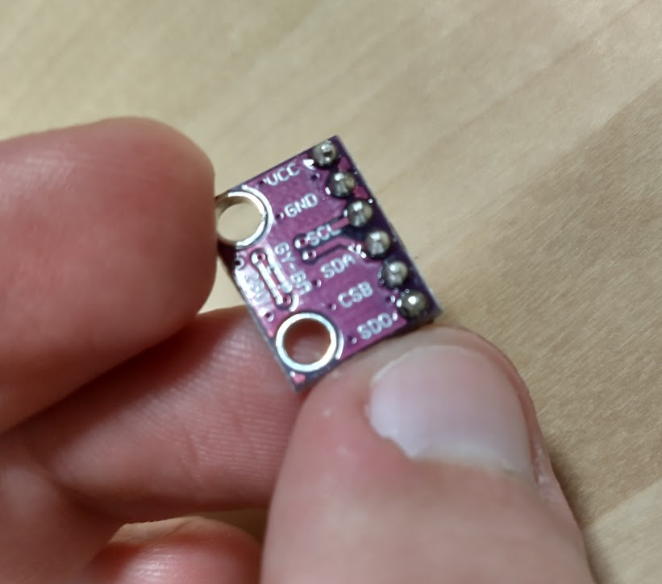
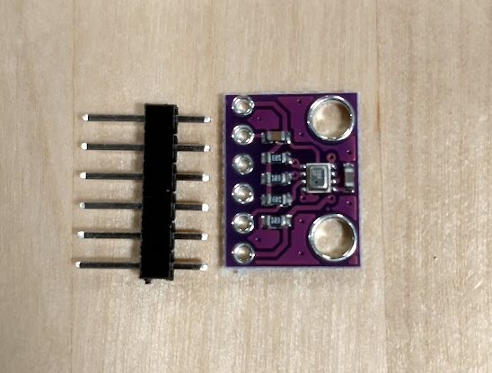
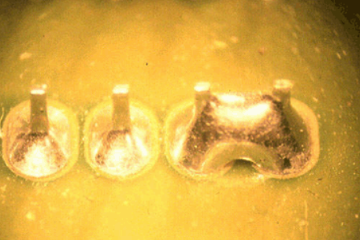

# "Some Assembly Required"
This chapter discusses soldering tips. If your modules came pre-assembled, this section can be skipped.

## What is Soldering?

You may have noticed that some of your Arduino modules come with their headers attached...

{width="250"}

...while others do not come with headers attached.

{width="250"}

The first module is said to have headers that are _soldered_. Soldering is a manufacturing process that involves fusing metal objects together via the application of molten metal. 

As we are using the modules on a breadboard, it is rather inconvenient that the headers for some of our modules are not attached. The reason that manufacturers leave them off is to provide maximum flexibility for customers. When the headers are not attached, we are free to pick the best headers to attach - whether straight or angled. We might also want to just solder the module to wires directly.

In our case though, we want to use straight headers so that the modules fit onto the breadboard.

## Equipment for Soldering

Soldering requires these tools:

- A [**soldering iron**](https://en.wikipedia.org/wiki/Soldering_iron) is a tipped tool that gets hot enough to melt solder.
- [**Solder**](https://en.wikipedia.org/wiki/Solder) is a conductive metal alloy with a low melting point.
- Because soldering involves melting metal, it is unwise to solder in an environment that is not well-ventilated. A [**fume absorber**](https://www.amazon.com/Absorber-Remover-Extractor-Prevention-Soldering/dp/B07VWDN29F/ref=sr_1_2_sspa?keywords=fume+extractor&qid=1674877852&sr=8-2-spons&psc=1&spLa=ZW5jcnlwdGVkUXVhbGlmaWVyPUExT0xaMkpTMTZaVFpOJmVuY3J5cHRlZElkPUEwNTkzOTk4MjdJRFlES1FXT1VHUCZlbmNyeXB0ZWRBZElkPUEwODIxMjkwQURERkdPTDkwNVVDJndpZGdldE5hbWU9c3BfYXRmJmFjdGlvbj1jbGlja1JlZGlyZWN0JmRvTm90TG9nQ2xpY2s9dHJ1ZQ==) or [**fume extractor**](https://www.tequipment.net/Quick/6101A1/Fume-Extraction-Units-&-Kits/?Source=googleshopping&gclid=Cj0KCQiAic6eBhCoARIsANlox86JNo6k_9vBoYZFgJsnvNQt8EERzkXplfM-YCvXZ1zXBt2xfxL1xWQaAlq7EALw_wcB) uses a fan to blow these fumes into a filter so that they are not inhaled.  

If you need to solder electronic components, consider going to the [EnVision Maker Space](https://jacobsschool.ucsd.edu/envision) on campus. It has all of the above equipment available and free to use for UCSD students.

## How to Solder

This video provides a quick guide to soldering.

<iframe width="560" height="315" src="https://www.youtube.com/embed/Qps9woUGkvI" title="YouTube video player" frameborder="0" allow="accelerometer; autoplay; clipboard-write; encrypted-media; gyroscope; picture-in-picture; web-share" allowfullscreen></iframe>

Like many fine motor skills, no amount of reading or video-watching will improve your abilities more than just a few minutes of practice. So go out there and try it!

## Avoid Too Much Solder

Apply enough solder to form the joint, but no more. If there is too much solder, it can form a short that will prevent the component from working. See the below image.

The two left joints are correctly soldered. The right two joints are shorted together.

