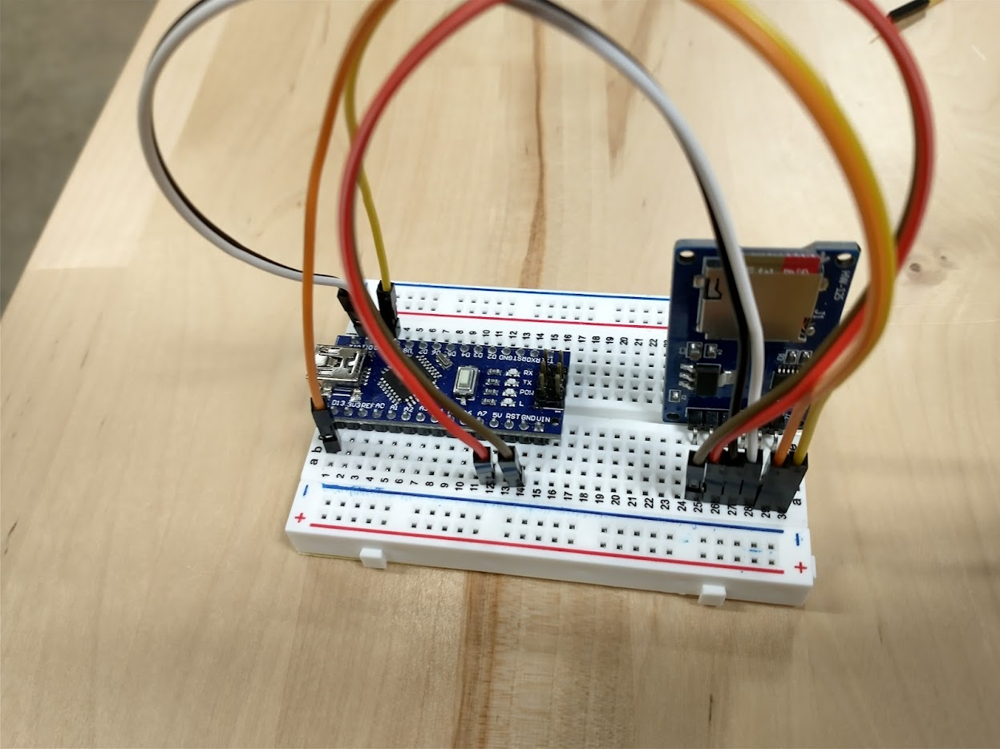
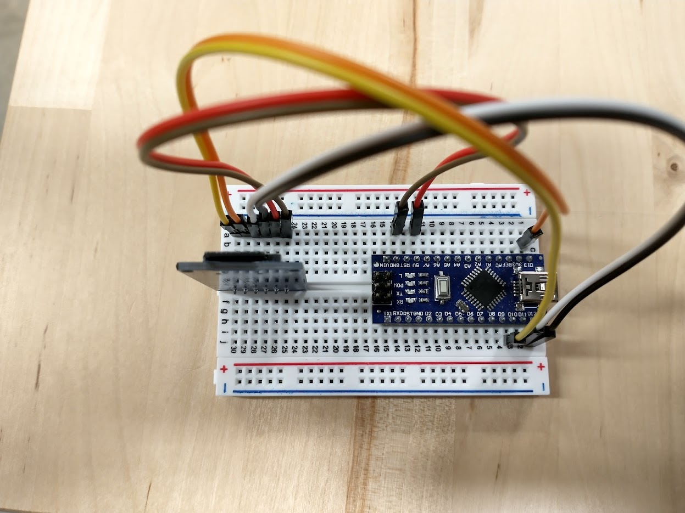

# The Micro SD Card Module

In this chapter, we will prepare the SD card for use with Arduino and integrate the SD Card Module.

## Formatting the Micro SD Card
Before we can do anything with the hardware, let's make sure our storage medium is ready for use.

### Why the SD Association Formatting Utility?
At the lowest level, storage devices like hard drives, SD cards, and flash drives provide a long array of memory addresses where bytes can be stored. However, at a high level, we like to think of data storage in a more hierarchical way where we store files in folders. **Formatting** a storage device is the process of preparing a storage device such that it is split into regions that help facilitate this higher-level organization method.

In a previous chapter, [we installed the SD Card Association Formatting Utility](./Level11.md). This software 

Why can't we use Windows or Mac's built-in SD formatting utilities? Arduinos are simple computers, so they cannot handle complex storage formats. Windows and Mac OS tend to ship with formatting utilities that create complex nonstandardized formats. These formats are objectively better in most cases, but they require actual computers to handle the many edge cases that come with the more complex formatting. On the other hand, the SD Association's utility deploys a standardized and simple format to the SD Card that only requires simple logic to read. The Arduino IDE ships with an SD Card library that is built to interface with this simple format. 

### Formatting using the Utility

TODO

## Mounting the Micro SD Card Module

Because the SD Card Module comes with bent headers, mounting it to the breadboard requires some creativity. Mounting card on breadboard rows 25-30 oriented vertically seems to work best as it allows the board to rest in the well of the breadboard.


## Wiring the SD Card Module

!!! info "Unplug the Arduino before Wiring"

    Unplugging the Arduino during this step will avoid potentially frying components.

The SD Card Module has 6 pins. Wire them as directed by the table below. The breadboard rows may differ if you placed it in a different location.

| MicroSD Pin | Row | Pin Purpose                                                                                      | Connect to Arduino Pin |
|-------------|-----|--------------------------------------------------------------------------------------------------|------------------------|
| GND         | 25  | Ground; current flows out of here to complete the circuit.                                       | Any free GND           |
| VCC         | 26  | Provides 5V of power into the module.                                                            | 5V                     |
| MISO        | 27  | "Master In Slave Out;" Wire for data sent FROM SD Card module TO the Arduino.                    | D12                    |
| MOSI        | 28  | "Master Out Slave In;" Wire for data sent FROM Arduino TO the SD Card module.                    | D11                    |
| SCK         | 29  | "Serial Clock," a repeating signal used to synchronize communications                            | D13                    |
| CS          | 30  | "Chip Select," used by the Arduino to differentiate multiple SPI modules  during initialization. | D10                    |

The following images demonstrate a properly wired SD Card module:





## Inserting the SD Card into the Module

With the module wired correctly, it is now time to insert the SD card.


!!! info "The SD Card should click in."

    The click will feel very tactile and satisfying. Please avoid the temptation to repeat this process for more times than is necessary as it causes wear to the module.

## Testing the SD Card Module

To test if your SD Card Module is wired properly, you can use the **built-in SD Card example sketch.**

!!! info "Double-check your Wiring before Powering Up"

    While the SD Module should have a voltage regulator to prevent you from accidentially frying it, it is still a good idea to double-check wiring before turning a device on.

In your Arduino IDE, navigate to File > Examples > SD > CardInfo. This will open the example CardInfo sketch. Then, change the `chipSelect` constant variable to `10` to reflect our wiring job. For me, it was on line 36.
```c title="Probably Line 36 of SD Example as is."
const int chipSelect = 4;
```
```c title="Probably Line 36 changed to 10"
const int chipSelect = 10;
```

Then, upload and run. Then, open the Serial Monitor. If your SD Module is wired correctly, and your micro SD card was formatted correctly, you should get filesystem info like what is shown below. The below dump is for a 32 GB SDHC card.

```txt title="Sample Filesystem Info when Wired + Formatted Correctly"
20:50:06.671 -> Initializing SD card...Wiring is correct and a card is present.
20:50:07.083 -> 
20:50:07.083 -> Card type:         SDHC
20:50:07.117 -> Clusters:          973200
20:50:07.150 -> Blocks x Cluster:  64
20:50:07.150 -> Total Blocks:      62284800
20:50:07.183 -> 
20:50:07.183 -> Volume type is:    FAT32
20:50:07.216 -> Volume size (Kb):  31142400
20:50:07.250 -> Volume size (Mb):  30412
20:50:07.283 -> Volume size (Gb):  29.70
20:50:07.316 ->
```

## Importing the SD Card Library in Your Own Files
The SD Card Library ships with the Arduino IDE, so no complex installation is necessary. Just add the `#include <SD.h>` directive to the top of your code file.

The following built-in example provides a good idea on how to utilize the library.

```c title="SD Card Library Example"
/*
  SD card read/write

  created   Nov 2010
  by David A. Mellis
  modified 9 Apr 2012
  by Tom Igoe

  This example code is in the public domain.

*/

#include <SD.h>

File myFile;

void setup() {
  // Open serial communications and wait for port to open:
  Serial.begin(9600);
  while (!Serial) {
    ; // wait for serial port to connect. Needed for native USB port only
  }


  Serial.print("Initializing SD card...");

  if (!SD.begin(10)) {
    Serial.println("initialization failed!");
    while (1);
  }
  Serial.println("initialization done.");

  // open the file. note that only one file can be open at a time,
  // so you have to close this one before opening another.
  myFile = SD.open("test.txt", FILE_WRITE);

  // if the file opened okay, write to it:
  if (myFile) {
    Serial.print("Writing to test.txt...");
    myFile.println("testing 1, 2, 3.");
    // close the file:
    myFile.close();
    Serial.println("done.");
  } else {
    // if the file didn't open, print an error:
    Serial.println("error opening test.txt");
  }

  // re-open the file for reading:
  myFile = SD.open("test.txt");
  if (myFile) {
    Serial.println("test.txt:");

    // read from the file until there's nothing else in it:
    while (myFile.available()) {
      Serial.write(myFile.read());
    }
    // close the file:
    myFile.close();
  } else {
    // if the file didn't open, print an error:
    Serial.println("error opening test.txt");
  }
}

void loop() {
  // nothing happens after setup
}

```