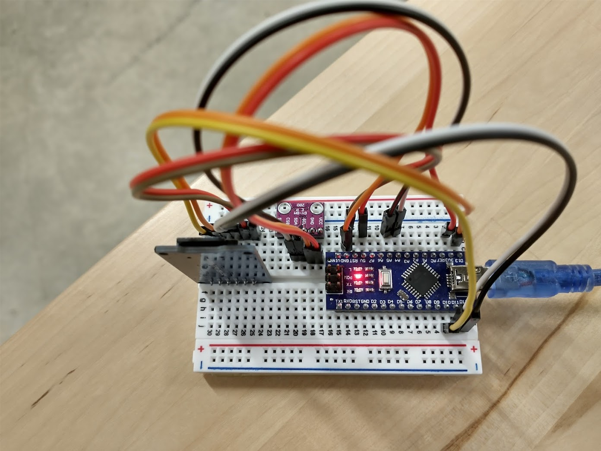
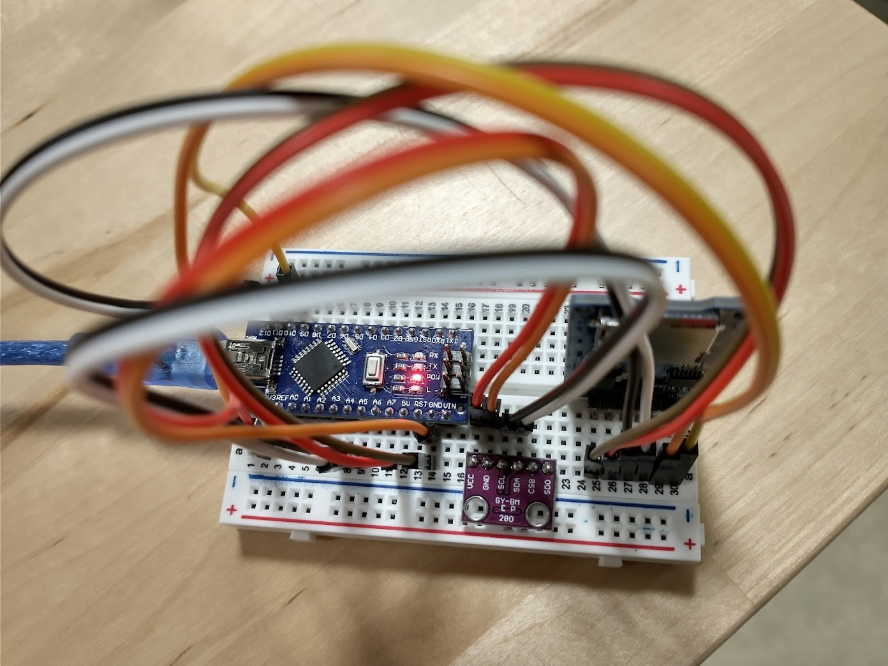
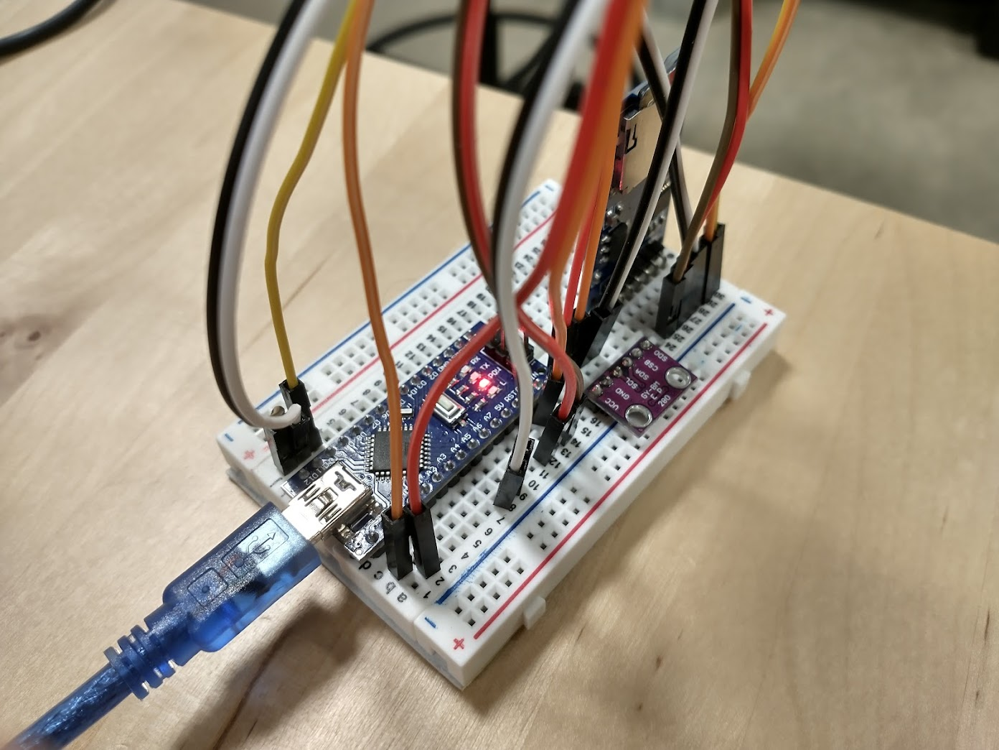
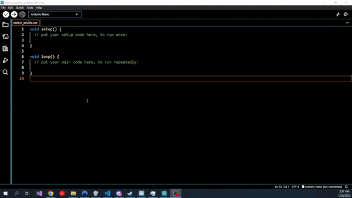

# The Altimeter Module (BMP 280)

In this chapter, we will integrate the BMP 280 module into the flight computer.

## About the Module

The BMP280 module integrates a pressure sensor and temperature sensor onto a single chip. Because air pressure can be related closely to altitude, this module can function as an altimeter.

## Mounting the Altimeter

I mounted the altimeter on the breadboard between the Arduino and the SD Card module. Ensure that the pins of the BMP280 do not share any rows with the SD Card Module. If this occurs, signals intended for one module will be sent to both, causing undefined behavior.


## Protocols, SPI, and I2C

A protocol is an agreed-upon set of rules to dictate how information is passed in a system. A protocol allows two parties to know exactly how to transmit their messages such that they can be interpreted by the receiver.

There are two major protocols for communications between electronic modules: SPI, or Serial Port Interface, and I2C, or Inter-Integrated Circuit. These protocols describe how data is encoded and decoded into electronic signals that can be transmitted over wires. Each protocol has its advantages and disadvantages, but for our purposes, we can summarize the pros and cons as follows:

- SPI tends to be faster than I2C
- SPI requires more wires than I2C
- I2C uses addresses to differentiate different modules. I2C devices only require two wires for communication, and multiple I2C modules can be "chained" on a single pair of wires.

The specific BMP280 module supports both I2C and SPI, but we will be using I2C as it is the default and it will make it easier to add additional modules if that interests you.

## Wiring the Module

!!! danger "**FEED THIS MODULE 3.3 VOLTS, __NOT__ 5 VOLTS**"

    Unlike the SD Card Module, this module does not have a voltage regulator. The module is rated for 3.3 volts. Feeding the module 5 volts **WILL** fry it. FEED IT 3.3 VOLTS!!!

The BMP20 Card Module has 6 pins. This module can operate using either software SPI or I2C. As we are using I2C, we will only use 4 of the 6 pins. Wire them as directed by the table below.

| BMP280 Pin | Row | Pin Purpose                                                                                     | Connect to Arduino Pin                       |
|------------|-----|-------------------------------------------------------------------------------------------------|----------------------------------------------|
| VCC        | 17  | Provides **3.3V of power** to this module.                                                      | 3.3V (IMPORTANT)                             |
| GND        | 18  | Ground; current flows out  of here to complete the  circuit.                                    | Any GND                                      |
| SCL        | 19  | "Serial Clock;" a repeating  signal used to synchronize communications                          | A5                                           |
| SDA        | 20  | "Serial Data;" transmits data from module to Arduino                                            | A4                                           |
| CSB        | 21  | "Chip Select," used by the Arduino to differentiate multiple SPI modules during initialization. | Do not wire; treating this as an I2C device. |
| SDO        | 22  | "Serial Data Out;" transmits data from module to Arduino                                        | Do not wire; treating this as an I2C device. |

The following images demonstrate functioning wiring:







## Finding the I2C Address

!!! danger "Check your Wiring before Power Up"

    Once again: this module does not have a voltage regulator. The module is rated for 3.3 volts. Feeding the module 5 volts **WILL** fry it. FEED IT 3.3 VOLTS!!! Incorrect wiring for other pins could also potentially fry the board. Double check, DO NOT BE LAZY!!!

I2C modules are given unique addresses to differentiate them. Typically, the manufacturer assigns this address arbitrarily and writes the accompanying code library to use that address as the default address. As we got a knockoff board, it is likely that the address of the module is different to that of the library's default address. Thus, in order to communicate with our BMP280, we will need it know its I2C address. 

There are two ways to find the address. The first is looking for the module's datasheet. These can be unwieldy to read for beginners, so we will instead find the address using an example Arduino sketch.

Open the Arduino IDE. Then, navigate to File > Examples > Wire > i2c_scanner. This example code iterates through every possible I2C address and outputs any detected modules to the Serial Monitor. Because we only have one I2C module wired up, (the SD card module is SPI) the one module we detect is our BMP280. 

Upload the code to your Arduino Nano and open the Serial Monitor. If you wired the module correctly, you should see an output like the following:

```txt title="I2C Scanner Output"
22:02:02.103 -> I2C Scanner
22:02:02.103 -> Scanning...
22:02:02.103 -> I2C device found at address 0x76  !
22:02:02.148 -> done
```

This tells us the I2C address for our BMP module is 0x76. The '0x' denotes a hexadecimal number; we can represent this number in decimal as 118. **Yours may be different. Just keep this value somewhere handy for the next sections.**

## The Library

The genuine Adafruit Bmp280 library should be compatible with our Bmp280 module. Unlike the SD Card Module, the Arduino IDE does not come with this library. We can install it via two methods:

- We could install manually by [downloading the ZIP from the Github page](https://github.com/adafruit/Adafruit_BMP280_Library) and placing it in the correct directory. (There is a time a place for this, but no thanks.)
- Install via the Arduino Library Manager (Yeah, this one.)

To open the Arduino Library Manager, click the books icon on the left-hand side of the screen. Or, use the ++ctrl+shift+i++ keyboard shortcut. Then, type `adafruit bmp280` into the search bar -- it should be the first result. To install the library, hover your mouse over the library and click install. When prompted to install dependencies for the library, click "install all." Once installed, restart your Arduino IDE. The following gif demonstrates this workflow:




## Testing the Module

We will test this module using yet another example sketch. The folks at Adafruit provide us with some examples to see how to use the library. In the Arduino IDE, navigate to File > Examples > Adafruit Bmp280 Library > bmp280test.

If we upload and run this example without changing it, we will get the following output from the Serial Monitor:

```txt title="Unmodified Bmp280 Example Output"
02:46:46.040 -> BMP280 test
02:46:46.040 -> Could not find a valid BMP280 sensor, check wiring or try a different address!
02:46:46.105 -> SensorID was: 0x0
02:46:46.139 ->         ID of 0xFF probably means a bad address, a BMP 180 or BMP 085
02:46:46.206 ->    ID of 0x56-0x58 represents a BMP 280,
02:46:46.239 ->         ID of 0x60 represents a BME 280.
02:46:46.306 ->         ID of 0x61 represents a BME 680.
```

This occurs because the library is trying to use the default address that Adafruit assigns to their genuine modules. Luckily, the Adafruit library provides a way to override this address. We're looking for the line `bmp.begin()`. This function initializes the connection between the Arduino and the Bmp280. It has an undocumented overload that allows us to pass in an address directly.

Change the line `bmp.begin()` (for me, it was on line 37) to `bmp.begin(<I2C ADDRESS YOU FOUND IN THE "Finding the I2C Address" SECTION>)` (for me, it would be `bmp.begin(0x76)`). Then, compile and upload.

The Serial Monitor should now display approximate temperature and altitude data. Awesome!

```txt title="Functioning Bmp280 Output"
02:55:10.901 -> BMP280 test
02:55:13.047 -> Temperature = 19.90 *C
02:55:13.047 -> Pressure = 100500.05 Pa
02:55:13.081 -> Approx altitude = 68.91 m
02:55:13.081 -> 
02:55:15.046 -> Temperature = 19.90 *C
02:55:15.046 -> Pressure = 100501.29 Pa
02:55:15.078 -> Approx altitude = 68.81 m
```