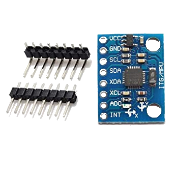

# Level 2: Above and Beyond

## Target Audience
Do you like electronics? Are you an all-code, all-the-time kind of person? Do you want to make something truly nuts?

I like you.

Welcome to Level 2. This is a blanket level that basically means "do everythig in Level 1, plus whatever you desire." For the sake of completeness, I will include a single suggestion of where to go from Level 1.

## Prerequisites

Level 1 defines the minimum viable custom flight computer. Finish that before going above and beyond.

## Hardware Requirements

Really, it is up to you to choose what additional modules you want to select. I have one suggestion, however.

### MPU 6050

{ width="175" align=left }

The MPU6050 is a six-axis accelerometer and gyroscope. This module can be used to measure the acceleration and orientation of the rocket as it flies. If enough people integrate this module onto their rockets, Owen Bartolf might write a program to visualize the trajectory of your rockets in 3D (if you ask nicely). 

- [:material-cart-variant: Cheaper in Bulk; Coordinate with Multiple Teams](https://www.amazon.com/HiLetgo-MPU-6050-Accelerometer-Gyroscope-Converter/dp/B00LP25V1A?th=1)

### Anything you imagine!

Go nuts.