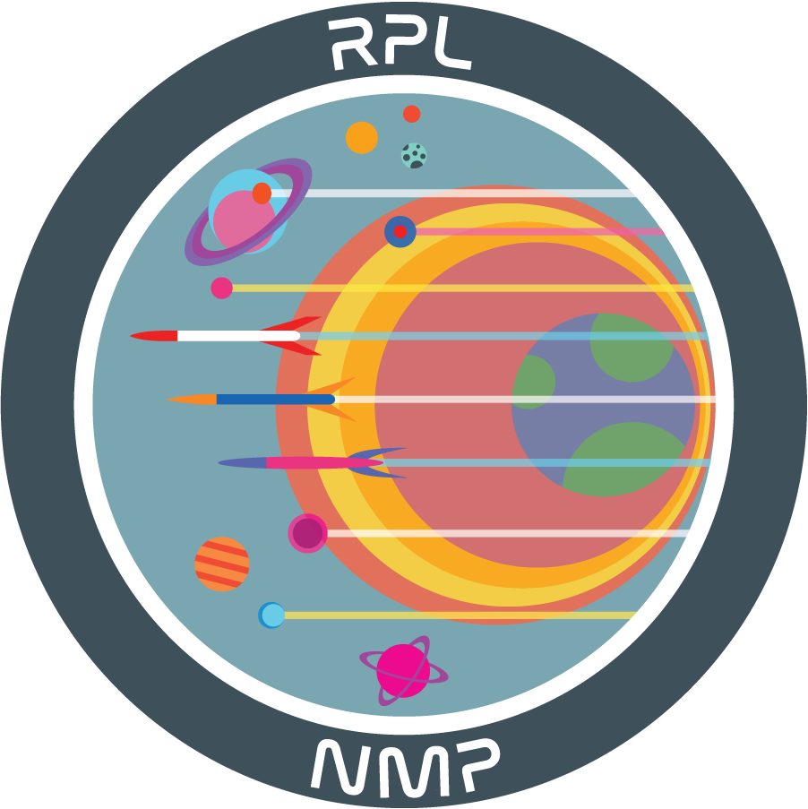
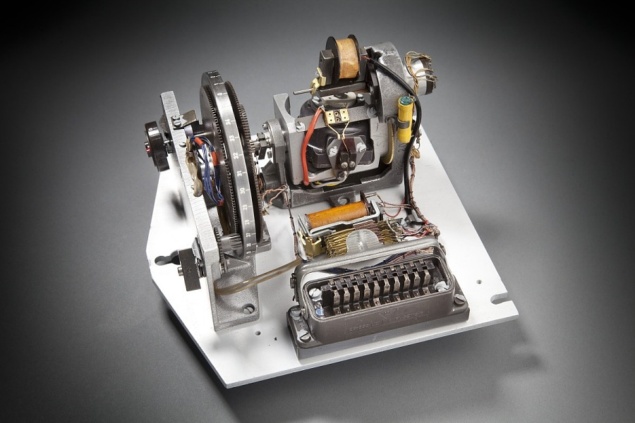
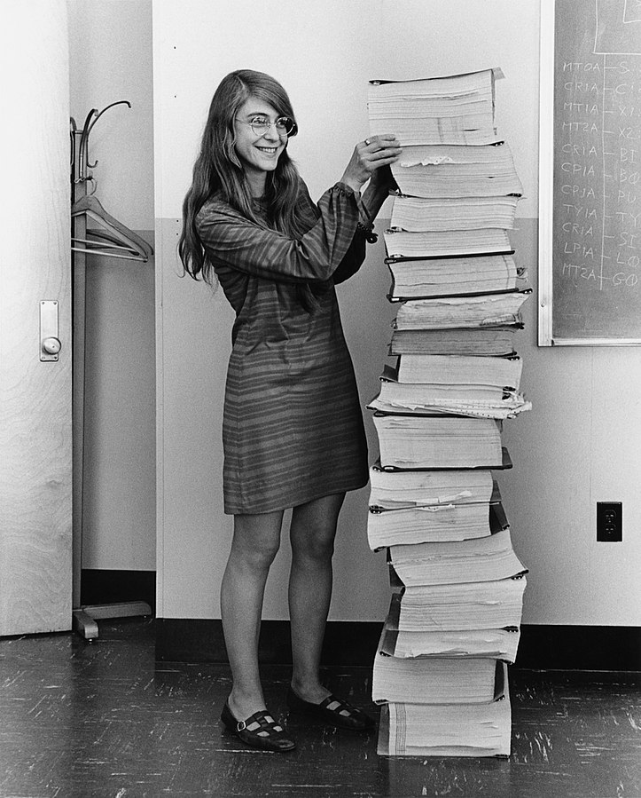

#

    

        <h1 style="margin-top: 2rem; margin-bottom: 0.25rem">NMP Avionics Guide</h1>
        <h2 style="margin-top: 0rem">Welcome! </h2>
    

    

        
    

In the Rocket Propulsion Lab New Member Project, teams are tasked with designing, fabricating, and launching a simple amateur rocket. This rocket has a simple mission profile: go as high as (reasonably and safely) possible, and recover the vehicle safely after flight.

To measure the success in achieving the objectives of this mission profile, an NMP rocket will be equipped with a simple avionics package that can record flight data.

## What is Avionics, and a Brief History
Avionics is a _portmanteau_ of "aviation electronics." It is a blanket term for any electronics that assist in controlling or operating aircraft and spacecraft. Avionics takes the form of many subfields, including guidance, navigation, and control (GNC); radio communications; pilot awareness (sensors); and more.

<figure markdown>
  { width="300" align=right }
  <figcaption>The V2 Guidance System (1944) used a combination of mechanical components and circuits to sense and integrate acceleration to get position and velocity.</figcaption>
</figure>

The first avionics packages were electromechanical in nature. Gryoscopes were physical objects that were rotated to maintain a frame of reference, and electronic signals were analog. However, as aviation and space flight developed in parallel to the semiconductor revolution, innovations in computer hardware enabled more sophisticated digital avionics. These digital avionics, like the Apollo Flight Computer, set the stage for a variety of new mission profiles. 

<figure markdown>
  { width="200" align=left }
  <figcaption>Margaret Hamilton, a prolific software engineer, standing next to the navigation software that she and her MIT team produced for the Apollo Guidance Computer. Predating general-purpose programming languages, the code for the computer was written entirely in assembly language.</figcaption>
</figure>

Today, hobbyist rocket flight computers start at about 8 times more powerful than the Apollo flight computer while having ~=4500x less mass. Innovations in computing continue to pay dividends, with advancements in artificial intelligence setting the stage for [entirely autonomous drone flights on distant worlds](https://www.nasa.gov/press-release/nasas-dragonfly-will-fly-around-titan-looking-for-origins-signs-of-life).

## Baseline Avionics Requirements
Your rocket's avionics package must perform the following functions:

- Record the maximum flight altitude.
- Save the maximum flight altitude to a storage medium so it can be read post-flight.

As long as your avionics package can perform these tasks, feel free to go above and beyond as much as you want.

## The Avionics Package Levels
To assist NMP teams of all skill levels, a couple guides have been prepared:

- [Level 0](../Level0/Level00.md) is targeted at teams that just want to acquire a pre-existing flight computer and not design anything on their own.
- [Level 1](../Level1/Level10.md) is oriented at teams that want to make a flight computer using an Arduino Nano and breakout boards.
